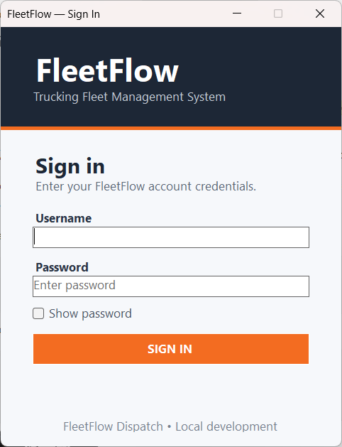
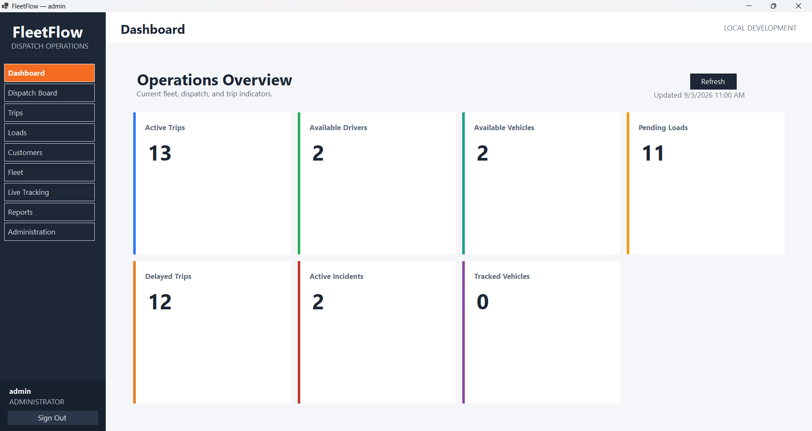
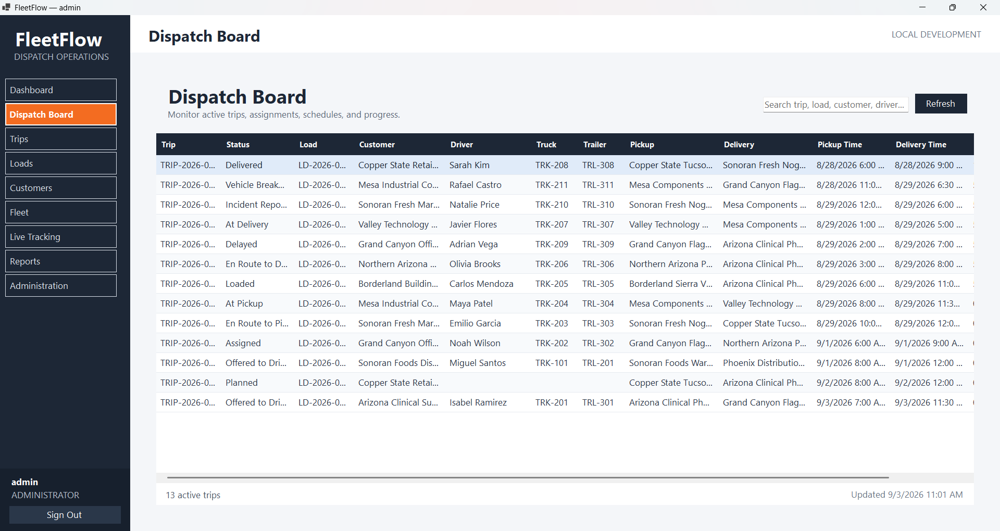
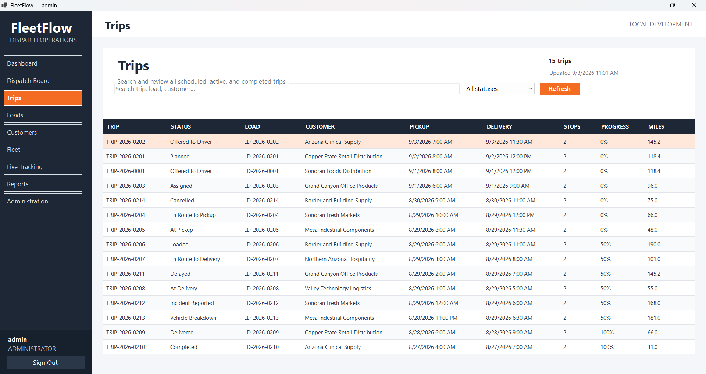
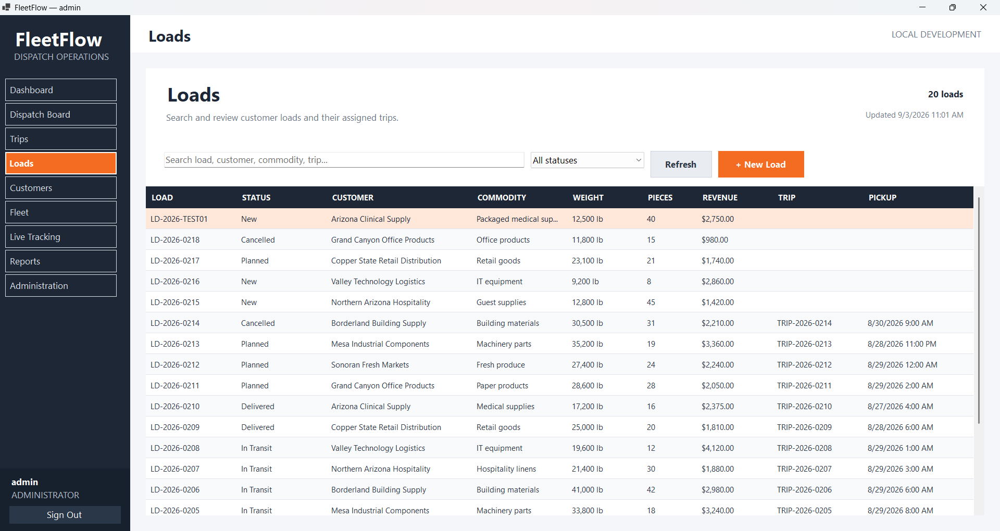
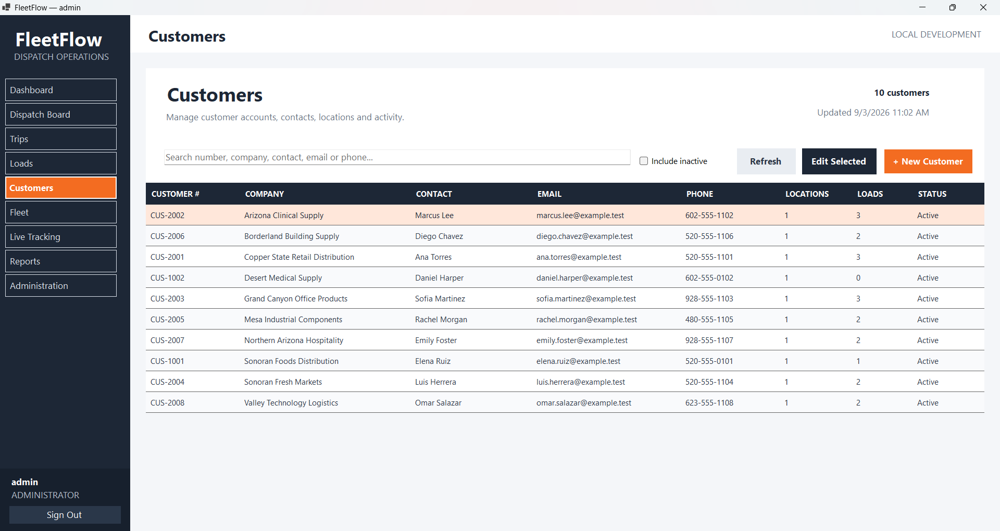
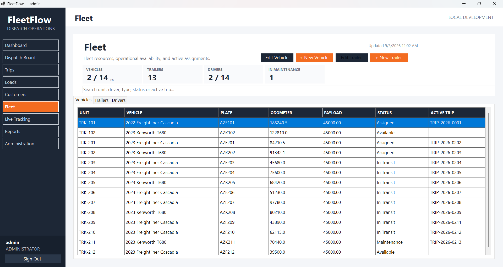
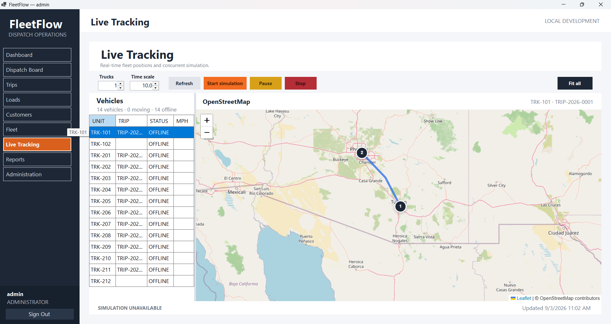
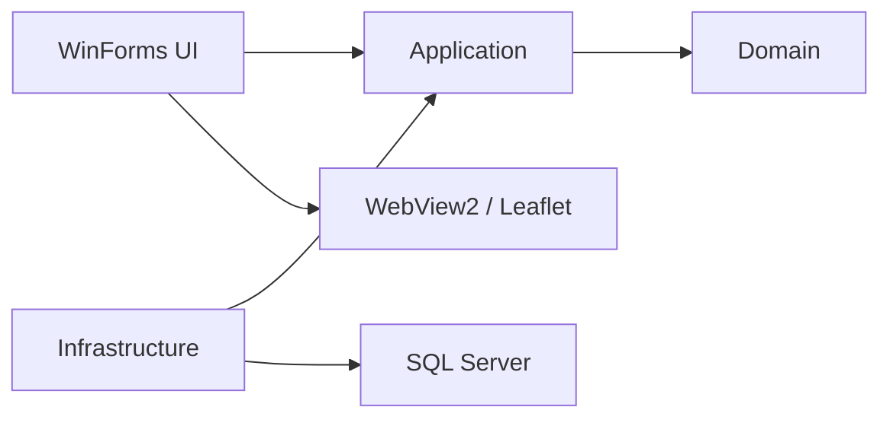
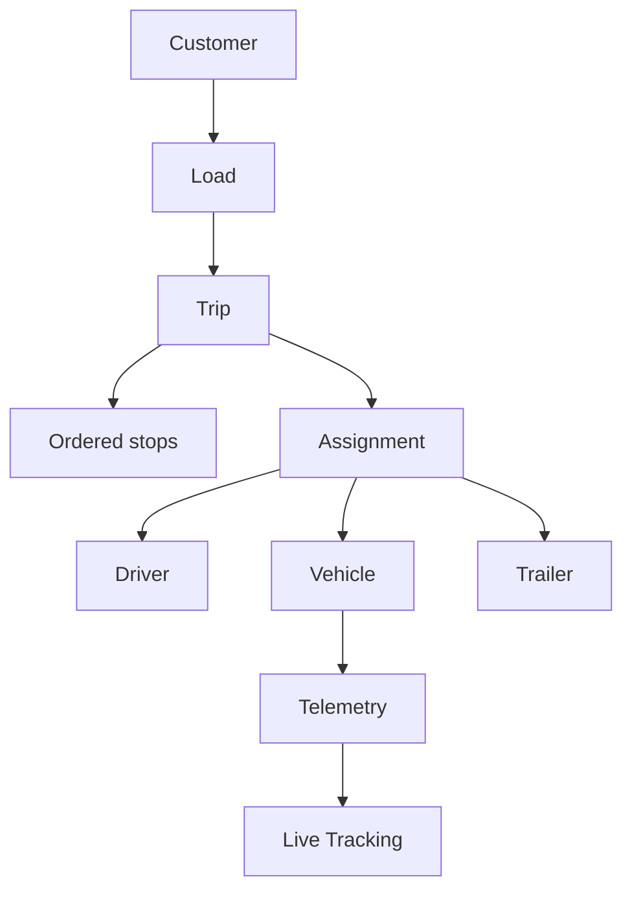

# FleetFlow

FleetFlow is a trucking fleet management system built to model the daily work of dispatch teams: customers request loads, loads become trips, trips receive drivers and equipment, and operational progress is tracked from pickup to delivery.

The current desktop application combines a C# Windows Forms client with a normalized SQL Server database and a stored-procedure-first data-access layer. It also includes the foundation for concurrent vehicle simulation and live fleet visualization with OpenStreetMap.

> **Project status:** Active development. The WinForms operational core is working; the Web API, Android application, reporting, and additional operational modules remain on the roadmap.


## Application preview

### Secure sign in

<p align="center">
  
</p>

### Operations dashboard



### Dispatch and trip management

| Dispatch board | Trips |
| --- | --- |
|  |  |

### Loads and customers

| Loads | Customers |
| --- | --- |
|  |  |

### Fleet and live tracking

| Fleet resources | Live tracking |
| --- | --- |
|  |  |

## Current capabilities

- Secure sign-in with application users, roles, and permissions.
- Operations dashboard with fleet, dispatch, trip, load, incident, and tracking indicators.
- Dispatch board for monitoring trips, assignments, schedules, and progress.
- Trip list, filtering, trip details, ordered stops, and status history.
- Load list, load details, creation, and update workflows.
- Customer accounts, customer details, contacts, and multiple locations.
- Vehicle and trailer overview, creation, editing, operational status, and activation control.
- SQL Server optimistic concurrency through `rowversion`.
- High-volume vehicle telemetry data model.
- Live Tracking interface backed by OpenStreetMap and Leaflet.
- Route and stop visualization.
- Concurrent simulation architecture where each simulated truck runs as an independent asynchronous task.
- Batched telemetry persistence to reduce database contention.
- Pause, resume, stop, time-scale, and vehicle-count controls for simulation runs.

## Architecture

FleetFlow follows a layered design that keeps business models, use cases, infrastructure, and the desktop interface separated.

```text
FleetFlow.Domain
    Core domain and security models

FleetFlow.Application
    Use cases, read models, requests, results, and service abstractions

FleetFlow.Infrastructure
    SQL Server implementations, authentication, telemetry, and simulation services

FleetFlow.Dispatch.WinForms
    Windows Forms dispatch client, forms, controls, and map integration

database
    Database creation, reference data, security, views, procedures, and validation
```

The projects depend inward through interfaces:



## Operational model



## Live Tracking and concurrent simulation

The simulation subsystem is designed to exercise concurrent operations instead of moving every vehicle from a single UI timer.

- Each truck simulation runs independently as an asynchronous task.
- A shared simulation engine manages active truck tasks.
- Pause and resume are coordinated without blocking UI threads.
- Cancellation tokens stop individual operations safely.
- Telemetry updates are buffered and written to SQL Server in batches.
- The WinForms control periodically refreshes vehicle state and sends map updates to JavaScript through WebView2.
- Offline vehicles remain visible in the vehicle list but are not rendered as map markers.
- Invalid or missing coordinates, including `(0,0)`, are excluded from map bounds.

This provides a controlled environment for testing race conditions, cancellation, database write pressure, telemetry ordering, and UI responsiveness.

## Database design

The SQL Server model is normalized and uses internal numeric keys together with human-readable business identifiers such as:

- `CUS-2001`
- `LD-2026-0201`
- `TRIP-2026-0201`
- `TRK-201`

Important database decisions include:

- UTC timestamps for operational and audit data.
- `rowversion` for optimistic concurrency.
- Ordered trip stops through `StopSequence`.
- Separate operational events and high-volume telemetry.
- Immutable history and audit records.
- Filtered unique indexes that prevent conflicting active assignments.
- Stored procedures as the application-facing database contract.
- Table-valued parameters for batch-oriented operations.
- Reproducible simulation runs and ordered route points.

## Technology stack

| Area | Technology |
| --- | --- |
| Language | C# |
| Desktop application | Windows Forms |
| Runtime | .NET 10 |
| Database | Microsoft SQL Server |
| Data access | Microsoft.Data.SqlClient and stored procedures |
| Dependency injection | Microsoft.Extensions.DependencyInjection |
| Embedded browser | Microsoft Edge WebView2 |
| Mapping | Leaflet and OpenStreetMap |
| Concurrency | Task-based asynchronous programming and cancellation tokens |
| Source control | Git and GitHub |

## Repository structure

```text
FleetFlow/
├── FleetFlow.Domain/
├── FleetFlow.Application/
├── FleetFlow.Infrastructure/
├── FleetFlow.Dispatch.WinForms/
│   ├── Controls/
│   ├── Forms/
│   └── MapAssets/
├── database/
├── docs/
│   └── screenshots/
└── FleetFlow.slnx
```

## Getting started

### Prerequisites

- Windows 10 or Windows 11.
- .NET 10 SDK.
- Visual Studio with the **.NET desktop development** workload.
- SQL Server, SQL Server Express, or LocalDB.
- SQL Server Management Studio or Azure Data Studio.
- Microsoft Edge WebView2 Runtime.

### 1. Clone the repository

```powershell
git clone https://github.com/Oscarvdo/FleetFlow.git
cd FleetFlow
```

### 2. Create the database

Connect to SQL Server with SQL Server Management Studio or Azure Data Studio. Run the base scripts in this order:

1. `database/001_create_database.sql`
2. `database/002_seed_reference_and_demo_data.sql`
3. `database/004_create_application_security.sql`
4. `database/005_create_database_api_schemas.sql`
5. `database/006_create_table_types_and_functions.sql`
6. `database/007_create_views.sql`
7. `database/008_create_stored_procedures.sql`
8. `database/009_create_protection_triggers_and_roles.sql`
9. `database/010_seed_workflow_rules.sql`
10. `database/003_validation_queries.sql`
11. `database/011_database_api_validation.sql`

After the base database succeeds, execute every incremental script numbered `012` and later in ascending order. These scripts add the dashboard, dispatch board, trip and load queries, customer maintenance, fleet maintenance, and Live Tracking.

The database name used by the application is:

```text
FleetFlowDb
```

Review each script before execution and run validation scripts after the schema and seed scripts complete.

### 3. Configure the connection string

Update `FleetFlow.Dispatch.WinForms/appsettings.json` for your SQL Server instance. Do not commit passwords or production credentials.

Example using Windows authentication:

```json
{
  "ConnectionStrings": {
    "FleetFlowDb": "Server=(localdb)\\MSSQLLocalDB;Database=FleetFlowDb;Integrated Security=true;TrustServerCertificate=true"
  }
}
```

### 4. Build and run

Open `FleetFlow.slnx` in Visual Studio and then:

1. Set `FleetFlow.Dispatch.WinForms` as the startup project.
2. Restore the NuGet packages.
3. Select **Build > Rebuild Solution**.
4. Confirm that `MapAssets/live-tracking-map.html` has **Build Action: Content** and **Copy to Output Directory: Copy if newer**.
5. Start the application with `F5`.

The repository intentionally does not document or publish real credentials. The security schema creates roles and permissions, but a new database still requires a local administrator whose password hash is generated by the .NET password hasher. Never insert or commit a plain-text password.

### 5. Verify the installation

After signing in, confirm that:

- The dashboard loads its operational counts.
- Dispatch Board, Trips, Loads, Customers, and Fleet return demo data.
- Live Tracking loads the OpenStreetMap tiles.
- Offline vehicles appear in the list but not as vehicle markers.
- Starting a simulation creates telemetry and displays active vehicles on the map.

## Screenshot setup

To display the screenshots in this README, add the image files using these exact paths:

```text
docs/screenshots/dashboard.png
docs/screenshots/dispatch-board.png
docs/screenshots/trips.png
docs/screenshots/loads.png
docs/screenshots/customers.png
docs/screenshots/fleet.png
docs/screenshots/live-tracking.png
docs/screenshots/sign-in.png
```

## Roadmap

- [x] Normalized SQL Server operational model.
- [x] Authentication, roles, and permissions.
- [x] Dashboard.
- [x] Dispatch board.
- [x] Trips and trip details.
- [x] Loads and load maintenance.
- [x] Customers and customer locations.
- [x] Vehicle and trailer management.
- [x] OpenStreetMap-based Live Tracking interface.
- [x] Concurrent simulation foundation.
- [ ] Complete simulation validation and operational scenarios.
- [ ] Driver management workflows.
- [ ] Assignment management workflows.
- [ ] Fuel records.
- [ ] Incident management.
- [ ] Operational history explorer.
- [ ] CSV import interface.
- [ ] Reports and analytical dashboards.
- [ ] User and role administration interface.
- [ ] ASP.NET Core Web API.
- [ ] .NET MAUI Android driver application.
- [ ] Shared read models across WinForms, API, and MAUI.
- [ ] Automated tests and continuous integration.

## Design goals

FleetFlow is intended to demonstrate more than CRUD screens. The project focuses on:

- Modeling real dispatch and fleet workflows.
- Preserving operational history instead of overwriting it.
- Maintaining responsive desktop behavior during concurrent work.
- Separating business use cases from SQL Server and WinForms concerns.
- Supporting future desktop, API, and mobile clients through shared application contracts.
- Providing realistic demo data without using real customer information.

## Development notes

- All demo companies and people are fictional.
- Demo email addresses should use reserved domains such as `.test`.
- Business timestamps are stored in UTC and converted for display by the client.
- OpenStreetMap data is displayed with the required attribution.
- Do not commit `bin`, `obj`, `.vs`, local secrets, database backups, or generated telemetry exports.

## Future clients

The planned ASP.NET Core Web API will expose the central operational services to additional clients. A future .NET MAUI Android application will allow drivers to receive assignments, update trip status, and send location data through the API rather than connecting directly to SQL Server.

## Author

Developed by [Oscar Valenzuela](https://github.com/Oscarvdo).

This repository is a portfolio and learning project focused on production-style fleet operations, desktop software, relational database design, and concurrent telemetry simulation.
