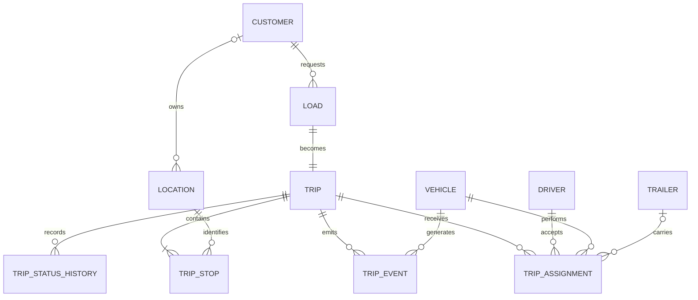

# FleetFlow database

Initial SQL Server model for the FleetFlow trucking fleet management system.
The first version supports Dispatch in Windows Forms, a future ASP.NET Core API,
the .NET MAUI driver application, and the concurrent truck simulator.

The model is normalized to 3NF. See `NORMALIZATION.md` for the dependency and
historical-data decisions.

## MVP boundary

Included now:

- customers;
- drivers;
- trucks and trailers;
- loads;
- trips and ordered stops;
- driver/truck/trailer assignments;
- trip status history;
- operational trip events and high-volume vehicle telemetry;
- CSV import batches with row-level validation errors;
- reproducible simulation runs and ordered route points;
- application users, roles, permissions, and security auditing.

Deferred until the core workflow is working:

- refresh tokens, trusted mobile devices, and password-reset workflows;
- proof-of-delivery files;
- fuel transactions;
- incidents;
- maintenance;
- reporting aggregates;
- invoicing and settlements.

## Core relationship

## Important design rules

1. All business timestamps use UTC. The UI converts them to local time.
2. Numeric identity keys are internal. Human-facing numbers such as
   `TRIP-2026-0001` remain unique business identifiers.
3. `rowversion` columns support optimistic concurrency between Dispatch, the
   API, and the driver application.
4. Filtered unique indexes prevent a driver, truck, trailer, or trip from
   having two active assignments.
5. Status values are reference data. The applications exchange status codes,
   not display text.
6. Trip stops are ordered through `StopSequence`; the first pickup and final
   delivery are not stored as duplicated columns on `Trips`.
7. `TripStatusHistory` is the business audit trail. `TripEvents` contains
   low-volume domain events; `VehicleTelemetry` contains high-volume time-series
   measurements generated by the simulator and future mobile app.
8. Customer addresses and operational destinations are normalized in
   `Locations`. A stop references one location instead of copying its address,
   coordinates, and contact information.
9. Imported master records retain an optional `SourceImportBatchId`, allowing
   every CSV-created row to be traced back to its file and validation result.
10. Simulator output retains `SimulationRunId`, while every event and telemetry
    row records its `DataOriginId`.

## Execution order

Run the scripts in SQL Server Management Studio or Azure Data Studio:

1. `001_create_database.sql`
2. `002_seed_reference_and_demo_data.sql`
3. `004_create_application_security.sql`
4. `003_validation_queries.sql`

The seed creates a Tucson-to-Phoenix demonstration trip, two drivers, two
trucks, two trailers, and two fictional customers. All email addresses use the
reserved `.test` domain.

It also creates five ordered route points and a reproducible simulation scenario
with seed `20260828`, time scale `10x`, and a two-second update interval.

The security script creates roles and their permissions but intentionally does
not create a user with a fabricated password. The first administrator will be
created from C# using the .NET password hasher.

## CSV demonstration files

The `sample-data` directory contains fictional CSV files for the first import
screen. Import them in the order documented in `CSV_CONTRACTS.md`. Files use
business identifiers such as `CustomerNumber`, `TripNumber`, and `UnitNumber`;
the C# import service resolves those values to internal database keys.

The importer should parse and validate the complete file before opening its
database transaction. It creates one `ImportBatches` row, records rejected rows
in `ImportBatchErrors`, and assigns `SourceImportBatchId` to accepted master and
trip records. CSV files never supply identity keys or trusted audit fields.

## Security model

Application access is role-based:

- `ADMINISTRATOR`;
- `FLEET_MANAGER`;
- `DISPATCHER`;
- `DRIVER`;
- `READ_ONLY`.

`AppUsers` stores only a .NET-generated password hash. `UserRoles` and
`RolePermissions` implement normalized many-to-many relationships. A driver
account can reference one row in `Drivers`, allowing the MAUI application to
return only that driver's assignments.

SQL Server LocalDB uses the signed-in Windows account. SQL Server logins and
production database principals are deployment concerns and are not application
users.

## First application workflow

1. Dispatch creates a load.
2. Dispatch creates a trip and its ordered stops.
3. Dispatch offers an assignment to one driver, truck, and optional trailer.
4. The driver app accepts or rejects the assignment.
5. The trip advances through pickup, loading, delivery, and completion.
6. Every transition is appended to `TripStatusHistory`.
7. The simulator or mobile app appends operational events to `TripEvents` and
   location/vehicle measurements to `VehicleTelemetry`.
